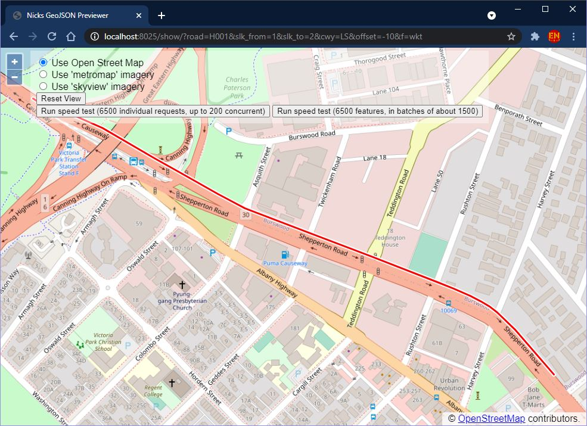

# Linear Referencing Geocoding Server <br> (Rust Version) <!-- omit in toc -->

## Table of Contents: <!-- omit in toc -->

- [1. Introduction](#1-introduction)
  - [1.1. Purpose](#11-purpose)
  - [1.2. Yes, But What For? (PowerBI Visuals)](#12-yes-but-what-for-powerbi-visuals)
  - [1.3. Previous python version project](#13-previous-python-version-project)
- [2. Usage](#2-usage)
  - [2.1. `/query/`](#21-query)
    - [2.1.1. Example `/query/`](#211-example-query)
  - [2.2. `/show/`](#22-show)
  - [2.3. `/batch/`](#23-batch)
- [3. Configuration](#3-configuration)
- [4. Data download and refresh](#4-data-download-and-refresh)
- [5. Coordinate Reference System (CRS)](#5-coordinate-reference-system-crs)
- [6. Future Features](#6-future-features)

## 1. Introduction

### 1.1. Purpose

Runs a REST server on localhost:8025 which will slice portions of the Main Roads
Western Australia road network based on query parameters and returns a GeoJSON
or WKT feature.

The query parameters `&road=...`, `&slk_from=...`, `&slk_to=...`  are required.
The parameters `&cwy=...` and `&offset=...` are optional.

The main difference from the GeoJSON service available at<http://data.wa.gov.au>
is that the `LineString` geometry will be properly truncated at the requested
SLK interval endpoints rather than simply filtered SQL-style like the ESRI rest
services.

### 1.2. Yes, But What For? (PowerBI Visuals)

The REST service can be conveniently called from Excel or PowerBI to augment any
table of data with a geometry column. This can then be used to visualise the
data in Power BI.

See my related PowerBI custom visual project here:
<https://github.com/thehappycheese/powerbi-visual-geojson-map-1>

In particular, note the branch called 'live' which aspires to dynamically
georeference data by relying on some instance of this REST service and
the `/batch/` feature described below.

### 1.3. Previous python version project

This is a rust implementation of my previous project written in python:
<https://github.com/thehappycheese/linear_referencing_geocoding_server>

Note there are some differences in the REST API from the previous python
version; For example:

- The `&cway=...` parameter has been renamed to `&cwy=...` in this version.
- Only `MultiLineString` features are returned; this means that `&slk_from`
  should not be equal to `&slk_to` for valid results.
- etc... please read the new documentation below carefully.

I plan to abandon the python version and maintain this rust version in the
future. This is because

| Issue        | Python                                                                                                                                                                                                                   | Rust                                                                                                                                                                                                                                                                                                                                                              |
| ------------ | ------------------------------------------------------------------------------------------------------------------------------------------------------------------------------------------------------------------------ | ----------------------------------------------------------------------------------------------------------------------------------------------------------------------------------------------------------------------------------------------------------------------------------------------------------------------------------------------------------------- |
| Speed        | Slow. 5 minutes + to georeference 12000 items.                                                                                                                                                                           | **Super fast**. The network connection is the bottleneck. Less than 30 seconds to georeference 12000 rows when used one row at a time, effectively instantaneous in `/batch/` mode.                                                                                                                                                                               |
| RAM          | Over 700Mb                                                                                                                                                                                                               | 70Mb (180Mb peek)                                                                                                                                                                                                                                                                                                                                                 |
| Startup time | Very slow.                                                                                                                                                                                                               | Also a bit slow (due to reading the input data and decompressing it in memory on every startup) but still much faster than the python version.                                                                                                                                                                                                                                                       |
| Dependencies | Depends on geopandas therefore it actually requires a 1GB+ stack of packages required by geopandas. On windows a simple `pip install` doesn't even work since pre-compiled binaries are required for pandas and shapely. | Needs to be compiled for the target platform, It produces a single statically linked binary which is very easy to distribute. Due to the magic of Cargo and the rust toolchain, it is incredibly easy to clone from github and compile without complicated setup. The only complication I have experienced on Debian was the need to manually install libssl-dev. |
| Deployment   | Requires a lot of setup to run in cloud environment... heavy resource requirements                                                                                                                                       | Using multi stage docker build it could probably be squished into a container that is about 50Mb in size. It shares some problems with the python version; it is slow to start, and expects to be always-running. This always running problem forfeits the possible cost benefits of running it on Azure Functions or similar.                                    |

## 2. Usage

### 2.1. `/query/`

By default query mode can be accessed at the following address:

<http://localhost:8025/query/?>...

The parameters are summarised in the table below:
| Name       | Description                                                                                                                                                                                             | Example Value               | Optional | Default   |
| ---------- | ------------------------------------------------------------------------------------------------------------------------------------------------------------------------------------------------------- | --------------------------- | -------- | --------- |
| `road`     | Main Roads Road Number or Local Government Road Number (case sensitive)                                                                                                                                 | `road=H001`                 | No       | -         |
| `slk_from` | Straight Line Kilometre to start the segment                                                                                                                                                            | `slk_from=1.55`             | No       | -         |
| `slk_to`   | Straight Line Kilometre to end the segment                                                                                                                                                              | `slk_to=2.3`                | No       | -         |
| `cwy`      | Filter for the carriageway. Must be some combination of the letters `L`, `R` and `S` (not case sensitive).                                                                                              | `cway=LS` or `cway=RS`      | Yes      | `LRS`     |
| `offset`   | Number of meters to offset the resulting line segments. Large values may not produce any output. Negative values are to the left of the road (in slk direction) and positive values are to the right.   | `offset=4` or `offset=-3.5` | Yes      | `0`       |
| `f`        | Desired response format. Must be `geojson`, `wkt` or `json` (not case sensitive). The `json` format is a nested array format which can be used as the `"coordinates":...` value for a `MultiLineString` | `f=geojson` or `f=wkt`      | Yes      | `geojson` |

#### 2.1.1. Example `/query/`

The following example fetches the Left and Single carriageway portions of Albany
Highway from slk 1km to 2km and offsets them 10 metres to the left of the road.
The result is returned in WKT format as a single `MULTILINESTRING` feature:

<http://localhost:8025/query/?road=H001&slk_from=1&slk_to=2&cwy=LS&offset=-10&f=wkt>

The response looks like this:

```wkt
MULTILINESTRING ((115.88771097361135 -31.967604589743765,115.88776331305647 -31.96753166223028,115.88782456479156 -31.967494045166685,115.88808285746482 -31.967581573012584,115.88842643824691 -31.967706811122067,115.88865106830647 -31.967794863020398,115.88878639134748 -31.967856418305686,115.88961385220324 -31.968270404421514),(115.88961222617614 -31.96826961114868,115.89009682355594 -31.968500014510138),(115.89009709103813 -31.968500142226866,115.8908060320806 -31.96884008302064,115.89130780129135 -31.96906658240955),(115.89129847166095 -31.9690630113479,115.8924861744535 -31.96944832848648),(115.89248599022535 -31.969448268938134,115.89367451654047 -31.969831024006037),(115.89367516412221 -31.96983123526756,115.89489443528633 -31.970234120891217),(115.89489484503049 -31.970234348879462,115.8952199535067 -31.97034351139344,115.89552559070945 -31.970457312501807,115.89572276324779 -31.97054445312055,115.89588899502093 -31.97062796284781,115.89603052161054 -31.9707213605839),(115.89603611706656 -31.97072540301373,115.8961699852627 -31.970830173406412,115.89636973106218 -31.970999046961516,115.89654509709025 -31.971164236270756,115.89708949236724 -31.971705035229636),(115.88735210575929 -31.967327078117492,115.88761740846113 -31.967472091243042),(115.88761495220085 -31.96747075121283,115.88782449298621 -31.967576711138406))
```

### 2.2. `/show/`

Show mode works the same as `/query/` mode except that instead of returning raw
data, it displays an interactive map when viewed in the browser. This is useful
to confirm that queries are working as intended.

<http://localhost:8025/show/?road=H001&slk_from=1&slk_to=2&cwy=LS&offset=-10&f=wkt>


Query mode can easily be used from Excel with the `=WEBSERVICE()` formula, or
from Power BI using the `=Web.Contents()` function.

### 2.3. `/batch/`

`/batch/` queries allow faster bulk georeferecing with minimal network traffic.

This mode expects a `POST` request to <http://localhost:8025/batch/> by default.
The body of the request must be binary data consisting of a series of frames
with the format shown in the table below. Any number of frames can be packed
into a single request.

| Byte Length | Type                  | Value                                  |
| ----------- | --------------------- | -------------------------------------- |
| 1           | Uint8                 | Number of bytes in `road` string `x`   |
| `x`         | Utf8 String           | `road` number                          |
| 4           | Float32 Little Endian | `slk_from` in kilometres               |
| 4           | Float32 Little Endian | `slk_to` in kilometres                 |
| 4           | Float32 Little Endian | `offset` in metres                     |
| 1           | Uint8                 | `cwy` (carriageways) (see table below) |

`cwy` is packed into a Uint8 as follows:
| `cwy` | Carriageway    | Binary          | Decimal |
| ----- | -------------- | --------------- | ------- |
| `R`   | Right only     | `0b0000_0001`   | 1       |
| `S`   | Single only    | `0b0000_0010`   | 2       |
| `RS`  | Right & Single | `0b0000_0011`   | 3       |
| `L`   | Left only      | `0b0000_0100`   | 4       |
| `LR`  | Left & Right   | `0b0000_0101`   | 5       |
| `LS`  | Left & Single  | `0b0000_0110`   | 6       |
| `LRS` | All            | any other value |         |

Th `/batch/` mode is impossible to use from Excel, and would require a very
complex PowerBI M script to work. It is intended to be used by other software
(eg. The custom PowerBI visual linked above).

There is an example batch query implementation in `__static_http/main.js`
however a simplified version is shown below:

```javascript
// =========== Helper functions: ===========
let CWY_LOOKUP = {
    L: 0b0000_0100,	R: 0b0000_0001,	S: 0b0000_0010,	LR: 0b0000_0101,
    LS: 0b0000_0110, RS: 0b0000_0011, LRS: 0b0000_0111
}
function binary_encode_request(road, slk_from, slk_to, offset, cwy) {
    let text_encoder = new TextEncoder();
    let road_bytes = text_encoder.encode(road);
    
    let buffer = new ArrayBuffer(1 + road_bytes.length + 4 + 4 + 4 + 1);

    let road_name_chunk = new Uint8Array(buffer, 0, 1 + road_bytes.length);
    road_name_chunk[0] = road_bytes.length;
    road_name_chunk.set(road_bytes, 1);

    let dataview = new DataView(buffer, 1 + road_bytes.length);
    dataview.setFloat32(0, slk_from, true) // LITTLE ENDIAN
    dataview.setFloat32(4, slk_to, true) // LITTLE ENDIAN
    dataview.setFloat32(8, offset, true) // LITTLE ENDIAN
    dataview.setUint8(12, CWY_LOOKUP[cwy.toUpperCase()] ?? 0); // use 0 if lookup fails

    return new Uint8Array(buffer);
}

// =========== Perform Batch Query ============

// Build batch query:
let request_body_parts = [
    binary_encode_request("H001", 1.0, 1.1, 0, "LRS"),
    binary_encode_request("H001", 3.0, 3.2, 0, "LS"),
    binary_encode_request("H002", 4.1, 4.2, 20, "LS")
];

// Find total query length in bytes:
let request_body_byte_length = request_body_parts.reduce(
    (total, item) => total + item.byteLength, 
    0 // initial value of total
);

// Pack all queries into a single byte array:
let request_body = new Uint8Array(request_body_byte_length);
request_body_parts.reduce((offset, byte_array) => {
        request_body.set(byte_array, offset);
        return offset + byte_array.byteLength;
    },
    0 // initial offset
)

// Send the request to the server
fetch("http://localhost:8025/batch/", {
        method: "POST",
        body: request_body
    }
)
.then(response => response.json())
.then(json => {
    let features = [];
    for (multi_line_string_coordinates of json) {
        if (multi_line_string_coordinates == null) continue;
        features.push({
            type: "Feature",
            geometry: {
                type: "MultiLineString",
                coordinates: multi_line_string_coordinates
            }
        });
    }
    let result = {
        type:"FeatureCollection",
        features
    }
    // DONE! 'result' is now a standard GeoJSON feature collection.
    //  ready to be used in a map or for other purposes.
    console.log(JSON.stringify(result));
});
```

The output of the script above is shown below:

```json
{
    "type":"FeatureCollection",
    "features":[
        {"type":"Feature","geometry":{"type":"MultiLineString","coordinates":[[[115.88778395521496,-31.967656968008896],[115.88783629466008,-31.96758404049541],[115.88784873900369,-31.967580563399395],[115.88804803150612,-31.96766437971354],[115.88831038467791,-31.967760094769094]],[[115.88778395521496,-31.967656968008896],[115.8877412235351,-31.967713333565143],[115.887742230063,-31.967723398843077],[115.8879828817074,-31.96785406445076]],[[115.8879828817074,-31.96785406445076],[115.88808710308484,-31.967912260057517]],[[115.8873090202252,-31.96740590345527],[115.88757432292704,-31.96755091658082]],[[115.8875744144296,-31.96755091658082],[115.88778395521496,-31.967656876506396]]]}},
        {"type":"Feature","geometry":{"type":"MultiLineString","coordinates":[[[115.90371854775746,-31.97874013724704],[115.90387696204294,-31.978944811166286],[115.90481214543112,-31.980341530482082]]]}},
        {"type":"Feature","geometry":{"type":"MultiLineString","coordinates":[[[115.79676132053224,-32.08478062909291],[115.79696805522983,-32.08570245636619]]]}}
    ]
}
```

## 3. Configuration

The application is hard-coded to look for a file called `config.json` in the
current working directory. If not present the application will `panic!`™ and
close with a non-zero exit code.

The content of `config.json` file should look like this:

```json
{
    "server":"0.0.0.0",
    "port":8025,
    "data_dir":"./__data_dir",
    "data_url":"https://mrgis.mainroads.wa.gov.au/arcgis/rest/services/OpenData/RoadAssets_DataPortal/MapServer/17/query?where=1%3D1&outFields=ROAD,START_SLK,END_SLK,CWY&outSR=4326&f=json",
    "static_dir":"./__static_http"
}
```

| Property     | Description                                                                                                                                                                                                                                                                                                                                                                                                                     |
| ------------ | ------------------------------------------------------------------------------------------------------------------------------------------------------------------------------------------------------------------------------------------------------------------------------------------------------------------------------------------------------------------------------------------------------------------------------- |
| `server`     | A string containing an IPV4 address. 0.0.0.0 will allow requests from anywhere. Using 127.0.0.1 wil limit traffic to your own machine for testing purposes.                                                                                                                                                                                                                                                                     |
| `port`       | A port number.                                                                                                                                                                                                                                                                                                                                                                                                                  |
| `data_dir`   | This directory will be used to store the road geometry data. When the data is missing the application will try to **delete this folder and all of its contents** before trying to re-download fresh data. so don't keep anything else in the specified directory, or specify a location that contains important files.                                                                                                          |
| `data_url`   | This is the ArcGIS REST service where the road network is downloaded from. It is assumed that multiple requests are required due to request limits, and the `&resultOffset=...` parameter is used to repeatedly fetch more data. Also note only certain fields are fetched and the output spatial reference is explicitly specified. ESRI's own json format is expected as `&f=geojson` format did not work for the default URL |
| `static_dir` | Used by the /show/ feature to display an interactive map. the directory specified by this config option should exist or I think the application will crash on startup.                                                                                                                                                                                                                                                          |

## 4. Data download and refresh

The application looks for a file called `output.json.lz4` in the directory
specified by the `"data_dir"` field in `config.json`. If the file or the
directory are not found, the application will try to delete the specified
directory (**and all of it's contents! be careful what directory you specify and
where the working directory is!**) and download replacement data from the
`"data_url"` specified in `config.json`.

To refresh your data, simply manually delete the folder and restart the server.

## 5. Coordinate Reference System (CRS)

The default CRS is EPSG:4326 which is also called WGS84 for eldritch reasons
beyond mortal comprehension (see <https://spatialreference.org/ref/epsg/wgs-84/>)

This software would almost work with any reference system except for the fact
that it needs to convert `&offset=[metres]` into degrees. It uses a simple
approximation for this which will not work if the CRS is changed.

It is therefore important that the input data is loaded in EPSG:4326. I believe
the `&outSR=4326` parameter in the following URL accomplishes this.

## 6. Future Features

- Prevent crash when missing `config.json`
- Allow environment variables as an alternative to `config.json`
- Prevent crash when missing `static_dir`
- Avoid deleting the `data_dir` as this might accidentally point to some
  unintended folder and cause loss of user data.
- Allow multiple features to be requested in `/query/` mode using the POST
  method with a json request body
- Allow requests where `slk_from` == `slk_to`, return `Point` and / or
  `MultiPoint` features in this case.
  - And / or, create a new path `/query_points/` which expects point requests only
- Decrease startup time to allow running in azure functions or similar?
  - I should re-consider using a database lookup instead of in-memory lookup. It
    seems like network performance is going to be the bottleneck now anyway...
    the ultra speed of in-memory lookup may be wasted. It is hard to predict how
    much slower this would be though. Optimising query plans didn't go well last
    time I tried... the database wants to sit and "TABLE SCAN" everything. It
    would take an expert to know how to index the database to get the kind of
    performance I would like. But, if I did get that working, it would make this
    application much lighter and faster and suitable for Azure functions or
    similar.
- Create docker image
