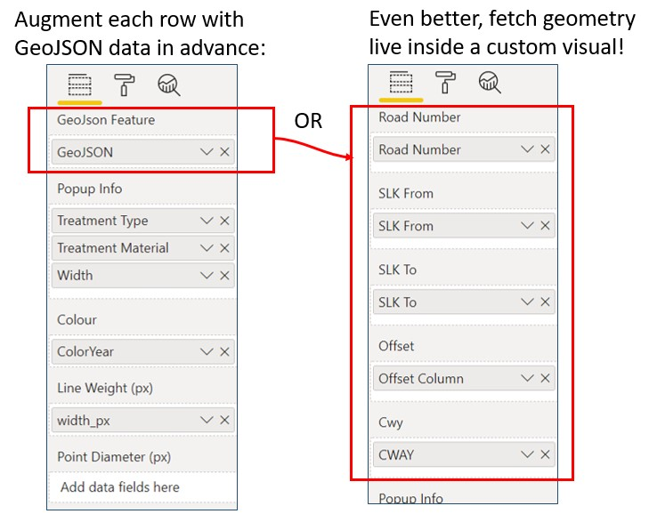

# Linear Referencing Geocoding Server <br> (Rust Version) <!-- omit in toc -->

## Table of Contents: <!-- omit in toc -->

- [1. Introduction](#1-introduction)
  - [1.1. Purpose](#11-purpose)
- [2. What For](#2-what-for)
  - [2.1. Icon Map](#21-icon-map)
  - [2.2. NickMap (My Custom Visual)](#22-nickmap-my-custom-visual)
- [3. Notes](#3-notes)
  - [3.1. SLK, True Distance and Chainage](#31-slk-true-distance-and-chainage)
  - [3.2. Local Government Roads](#32-local-government-roads)
  - [3.3. Principal Shared Paths (PSPs) (State Owned Paths)](#33-principal-shared-paths-psps-state-owned-paths)
- [4. Usage](#4-usage)
  - [4.1. Normal Usage - Text Response (GeoJSON / WKT / JSON / LATLON)](#41-normal-usage---text-response-geojson--wkt--json--latlon)
    - [4.1.1. Example - Get a MultiLineString in WKT](#411-example---get-a-multilinestring-in-wkt)
    - [4.1.2. Example - Get a MultiPoint in GeoJSON](#412-example---get-a-multipoint-in-geojson)
    - [4.1.3. Example - Get a single comma separated latitude longitude pair (`f=latlon`)](#413-example---get-a-single-comma-separated-latitude-longitude-pair-flatlon)
  - [4.2. Usage - `/show/` Mode](#42-usage---show-mode)
  - [4.3. Usage - `/batch/` Mode](#43-usage---batch-mode)
  - [4.4. Usage - Configuration](#44-usage---configuration)
  - [4.5. Usage - Data Download and Refresh](#45-usage---data-download-and-refresh)
  - [4.6. Usage - Coordinate Reference System (CRS)](#46-usage---coordinate-reference-system-crs)
- [5. Roadmap / Future Features](#5-roadmap--future-features)
- [6. Compiling this code for your platform](#6-compiling-this-code-for-your-platform)
  - [6.1. Ubuntu / Debian](#61-ubuntu--debian)
  - [6.2. Windows](#62-windows)
- [7. Deploying the server](#7-deploying-the-server)
  - [7.1. Amazon Lightsail](#71-amazon-lightsail)
- [8. Related Projects](#8-related-projects)
  - [8.1. Python version (Predecessor to this Rust version)](#81-python-version-predecessor-to-this-rust-version)
  - [8.2. Megalinref (Successor / Sibling to this Repo)](#82-megalinref-successor--sibling-to-this-repo)

## 1. Introduction

### 1.1. Purpose

This application is a 'Web Service' (which runs as a windows or linux
executable) which can be queried to slice portions of the Western Australia road
network geometry and return either `GeoJSON` or `WKT` features. For example
Excel can query this service using the
[`=WEBSERVICE()` formula](https://support.microsoft.com/en-us/office/webservice-function-0546a35a-ecc6-4739-aed7-c0b7ce1562c4).

To use pre-compiled version of this application please visit the
[releases](/releases) page and download and extract one of the zip files.

Run `nicklinref.exe` then visit
<http://localhost:8080/?road=H001&slk_from=1.5&slk_to=3> to test if it is
working.

The required URL parameters are `road`, `slk_from`, and `slk_to`. Optionally,
the parameters `cwy` and `offset` can be used to select one or more
carriageway(s), and/or offset the resulting geometry. The `&f=WKT` can be added
to get WKT instead of the default GeoJSON output.

<details>

<summary>Doesn't this already exist? (Click here to expand this section)</summary>

This software is different from the from the 'Web Services' / APIs already available at
<https://data.wa.gov.au> because it properly truncates the geometry at the
requested `slk_from` and `slk_to` endpoints. The web services available at
<https://data.wa.gov.au> can only filter records that intersect the requested SLK range
according to the row structure of the underlying storage table.

Each row (in the database storing the Road Network) has a fixed `START_SLK` and
`END_SLK`, and contains the road geometry for that section. Each row typically
represents a section of road from one intersection to the next intersection. The web
services at <https://data.wa.gov.au> can only return whole rows, and are not able
to return only a portion of the road geometry if the requested range partly
intersects with a row's SLK range.

An ArcMap geoprocessing model could be used as an alternative to this software.
To achieve the same result it ends up being a pretty complicated model involving
several calls to `CreateRoutes_lr` and `MakeRouteEventLayer_lr` functions with a
heap of filters, joins and projections. Never the less, this model could be
published as a 'Geoprocessing Service' with very similar features to this web
service. There are a few reasons I think this software may perform better
anyway, or be more convenient:

- this rust implementation will probably be faster, especially in row-by-row
  mode.
- this rust version may use less cpu, ram and storage on the server
- an arcgis based service may only support a batch mode, requiring CSV input.
  This would not be useable with Excels `=WEBSERVICE()` formula, and much more
  difficult to use with PowerBI's `=Web.Contents()` function.
- the arcgis service may not support GeoJSON or WKT. Only EsriJSON seems to work
  reliably.
- this rust version will use less bandwidth in batch mode due to the binary
  input format. This is much more suitable for interfacing directly with PowerBI
  visuals.

</details>


## 2. What For

This application can be conveniently used from Excel using the
`=WEBSERVICE(...)` formula or from PowerBI using the `=Web.Contents(...)`
function to augment any table of data with a geometry column. This can then be
used to visualise the data in Power BI.

### 2.1. Icon Map

IconMap can be used with any table of data containing a column consisting of
WKT. <https://icon-map.com/> IconMap is an excellent visual which is finished
and polished and is easy to download and use.

### 2.2. NickMap (My Custom Visual)

> Note: the url below is broken for the time being.

See my related PowerBI custom visual project here:
<https://github.com/thehappycheese/powerbi-visual-geojson-map-1> This visual is
A work-in-progress and there is no compiled visual ready for distribution.

If everything goes to plan, this visual might be better than IconMap:


> **Note:** the `live` branch of this project uses the new `/batch/`
> feature described below to _dynamically_ georeference the data, so that
> augmenting the source data ahead of time is not required :)



## 3. Notes

### 3.1. SLK, True Distance and Chainage

SLK stands for "Straight Line Kilometre" and is sometimes called 'chainage' or
'kilometrage' in other contexts.

At Main Roads Western Australia SLK refers to an "adjusted" linear measure which
has discontinuities called 'Points of Equation' (there are between 100 and 200
points of equation throughout the state road network) where there is an abrupt
increase or decrease in SLK. This is done so that when asset locations are
recorded by SLK, these records are not invalidated when a road realignment
project modifies the length of a road.

This software has no special compensation to handle POE discontinuities. Please
expect results at POEs to have gaps or overlaps.

The non-adjusted linear measure is called "True Distance".

This software is only capable of looking up Lat/Lon from SLK. True distance is
not yet supported.

### 3.2. Local Government Roads

Local government roads are supported.

### 3.3. Principal Shared Paths (PSPs) (State Owned Paths)

PSPs are are supported.


## 4. Usage

### 4.1. Normal Usage - Text Response (GeoJSON / WKT / JSON / LATLON)

When the web service is running locally (on your own machine) it can be accessed at the following address by default:

<http://localhost:8080/?>...

The  parameters are summarised in the table below:

| Name       | Description                                                                                                                                                                                           | Example Value               | Optional | Default   |
| ---------- | ----------------------------------------------------------------------------------------------------------------------------------------------------------------------------------------------------- | --------------------------- | -------- | --------- |
| `road`     | Main Roads Road Number or Local Government Road Number (case sensitive)                                                                                                                               | `road=H001`                 | No       | -         |
| `slk_from` | Straight Line Kilometre to start the segment                                                                                                                                                          | `slk_from=1.55`             | No       | -         |
| `slk_to`   | Straight Line Kilometre to end the segment                                                                                                                                                            | `slk_to=2.3`                | No       | -         |
| `slk`      | Straight Line Kilometre to a point. (should not be combined with `slk_from` and `slk_to`, see notes below)                                                                                            | `slk=3`                     | No       | -         |
| `cwy`      | Filter for the carriageway. Must be some combination of the letters `L`, `R` and `S` (not case sensitive).                                                                                            | `cway=LS` or `cway=RS`      | Yes      | `LRS`     |
| `offset`   | Number of metres to offset the resulting line segments. Large values may not produce any output. Negative values are to the left of the road (in slk direction) and positive values are to the right. | `offset=4` or `offset=-3.5` | Yes      | `0`       |
| `f`        | Desired response format. Must be `geojson`, `wkt`, `json`, `latlon` or `latlondir`. (see notes below)                                                                                                 | `f=geojson`                 | Yes      | `geojson` |
| `m`        | Option to include `M` coordinates in `geojson`, `wkt` or `json` modes.                                                                                                                                | `m=true`                    | Yes      | `false`   |

> **Note:**
> 
> 1. Parameters are case insensitive; `CWY=LS` should work the same as `cwy=ls`.
> 1. If `slk_from` and `slk_to` are provided then
>    - the `slk` parameter is ignored if present
>    - A MultiLineString geometry is returned
>    - even if only a single LineString is generated it still returns it as a
>      MultiLineString geometry
> 1. If the `slk` parameter is used then
>    - MultiPoint geometry will be returned
>    - even if only a single point is generated it still returns it as a MultiPoint geometry
> 1. When `f=GeoJSON` responses are always wrapped in a `Feature`.
> 1. The `f=json` format is a nested array in the same format as the geojson
>    `MultiLineString` or `MultiPoint` `"coordinates":...` array format.
> 1. The `f=latlon` and `f=latlondir` formats are special:
>    - These formats are only valid when using the `slk=` mode.
>    - It will always return a single comma separated latitude longitude pair;
>    - If multiple points would have been returned (left and right carriageway)
>      then the average of these positions is returned
>    - `latlondir` is the same but followed by another comma and then the direction,
>       in degrees. When the direction is averaged (between left and right carriageway)
>       weird things might happen if the carriageways are going in very different directions.
>       Direction is measured anti-clockwise-positive from east.


#### 4.1.1. Example - Get a MultiLineString in WKT

The following example fetches the Left and Single carriageway portions of Albany
Highway from slk 1km to 2km and offsets them 10 metres to the left of the road.
The result is returned in WKT format as a single `MULTILINESTRING` feature:

<http://localhost:8080/?road=H001&slk_from=1&slk_to=2&cwy=LS&offset=-10&f=wkt> ⟶

```wkt
MULTILINESTRING ((115.88771097361135 -31.967604589743765,115.88776331305647 -31.96753166223028,115.88782456479156 -31.967494045166685,115.88808285746482 -31.967581573012584,115.88842643824691 -31.967706811122067,115.88865106830647 -31.967794863020398,115.88878639134748 -31.967856418305686,115.88961385220324 -31.968270404421514),(115.88961222617614 -31.96826961114868,115.89009682355594 -31.968500014510138),(115.89009709103813 -31.968500142226866,115.8908060320806 -31.96884008302064,115.89130780129135 -31.96906658240955),(115.89129847166095 -31.9690630113479,115.8924861744535 -31.96944832848648),(115.89248599022535 -31.969448268938134,115.89367451654047 -31.969831024006037),(115.89367516412221 -31.96983123526756,115.89489443528633 -31.970234120891217),(115.89489484503049 -31.970234348879462,115.8952199535067 -31.97034351139344,115.89552559070945 -31.970457312501807,115.89572276324779 -31.97054445312055,115.89588899502093 -31.97062796284781,115.89603052161054 -31.9707213605839),(115.89603611706656 -31.97072540301373,115.8961699852627 -31.970830173406412,115.89636973106218 -31.970999046961516,115.89654509709025 -31.971164236270756,115.89708949236724 -31.971705035229636),(115.88735210575929 -31.967327078117492,115.88761740846113 -31.967472091243042),(115.88761495220085 -31.96747075121283,115.88782449298621 -31.967576711138406))
```

#### 4.1.2. Example - Get a MultiPoint in GeoJSON

The following example fetches the a point for both the Left and right
carriageway portions of Albany Highway at slk 2km. The format is not specified
and therefore the result is returned in default GeoJSON as a`MultiPoint`
feature:

<http://localhost:8080/?road=H001&slk=2> ⟶

```json
{"type":"Feature", "geometry":{"type":"MultiPoint", "coordinates":[[115.89702617983814,-31.97176876372234],[115.89692159880637,-31.97178473847775]]}}
```

#### 4.1.3. Example - Get a single comma separated latitude longitude pair (`f=latlon`)

The following example fetches the a single pointon Albany Highway at slk 2km.
Since there is no carriageway filter, it returns a position somewhere between
the left and right carriageway. The format is not specified and therefore the
result is returned in default GeoJSON as a`MultiPoint` feature:

<http://localhost:8080/?road=H001&slk=2> ⟶

```json
{"type":"Feature", "geometry":{"type":"MultiPoint", "coordinates":[[115.89702617983814,-31.97176876372234],[115.89692159880637,-31.97178473847775]]}}
```

### 4.2. Usage - `/show/` Mode

Show mode works the same as described above, except that instead of returning
raw data, it displays an interactive map when viewed in a web browser. This is
useful to confirm that queries are working as intended.

<http://localhost:8080/show/?road=H001&slk_from=1&slk_to=2&cwy=LS&offset=-10&f=wkt>


Query mode can easily be used from Excel with the `=WEBSERVICE()` formula, or
from Power BI using the `=Web.Contents()` function.

### 4.3. Usage - `/batch/` Mode

`/batch/` mode is an advanced feature that allows ultra-fast georeferecing with
minimal network traffic. This mode exists to integrate with PowerBI custom
visuals.

This mode expects a `POST` request to <http://localhost:8080/batch/> by default.
See details below.

<details>
<summary style="color:red; font-weight:bold; font-size:1.1em;margin:2em 0">Click to expand details of `/batch/` Mode</summary>

The body of the request must be binary data consisting of a series of frames
with the format shown below. Any number of frames can be packed into a single
request.

Frame format:

| Byte Length | Type                  | Value                                  |
| ----------- | --------------------- | -------------------------------------- |
| 1           | Uint8                 | Number of bytes in `road` string `x`   |
| `x`         | Utf8 String           | `road` number                          |
| 4           | Float32 Little Endian | `slk_from` in kilometres               |
| 4           | Float32 Little Endian | `slk_to` in kilometres                 |
| 4           | Float32 Little Endian | `offset` in metres                     |
| 1           | Uint8                 | `cwy` (carriageways) (see table below) |

Value of `cwy`:

| `cwy` | Carriageway    | Binary          | Decimal |
| ----- | -------------- | --------------- | ------- |
| `R`   | Right only     | `0b0000_0001`   | 1       |
| `S`   | Single only    | `0b0000_0010`   | 2       |
| `RS`  | Right & Single | `0b0000_0011`   | 3       |
| `L`   | Left only      | `0b0000_0100`   | 4       |
| `LR`  | Left & Right   | `0b0000_0101`   | 5       |
| `LS`  | Left & Single  | `0b0000_0110`   | 6       |
| `LRS` | All            | any other value |         |

There is an example batch query implementation in `__static_http/main.js`
however a simplified version is shown below:

```javascript
// =========== Helper functions: ===========
let CWY_LOOKUP = {
    L: 0b0000_0100,
    R: 0b0000_0001,
    S: 0b0000_0010,
    LR: 0b0000_0101,
    LS: 0b0000_0110,
    RS: 0b0000_0011,
    LRS: 0b0000_0111
}
function binary_encode_request(road, slk_from, slk_to, offset, cwy) {
    let text_encoder = new TextEncoder();
    let road_bytes = text_encoder.encode(road);
    
    let buffer = new ArrayBuffer(1 + road_bytes.length + 4 + 4 + 4 + 1);

    let road_name_chunk = new Uint8Array(buffer, 0, 1 + road_bytes.length);
    road_name_chunk[0] = road_bytes.length;
    road_name_chunk.set(road_bytes, 1);

    let data_view = new DataView(buffer, 1 + road_bytes.length);
    data_view.setFloat32(0, slk_from, true) // LITTLE ENDIAN
    data_view.setFloat32(4, slk_to, true) // LITTLE ENDIAN
    data_view.setFloat32(8, offset, true) // LITTLE ENDIAN
    data_view.setUint8(12, CWY_LOOKUP[cwy.toUpperCase()] ?? 0); // use 0 if lookup fails

    return new Uint8Array(buffer);
}

// =========== Perform Batch Query ============

// Build batch query:
let request_body_parts = [
    binary_encode_request("H001", 1.0, 1.1, 0, "LRS"),
    binary_encode_request("H001", 3.0, 3.2, 0, "LS"),
    binary_encode_request("H002", 4.1, 4.2, 20, "LS")
];

// Find total query length in bytes:
let request_body_byte_length = request_body_parts.reduce(
    (total, item) => total + item.byteLength, 
    0 // initial value of total
);

// Pack all queries into a single byte array:
let request_body = new Uint8Array(request_body_byte_length);
request_body_parts.reduce((offset, byte_array) => {
        request_body.set(byte_array, offset);
        return offset + byte_array.byteLength;
    },
    0 // initial offset
)

// Send the request to the server
fetch("http://localhost:8080/batch/", {
        method: "POST",
        body: request_body
    }
)
.then(response => response.json())
.then(json => {
    let features = [];
    for (multi_line_string_coordinates of json) {
        if (multi_line_string_coordinates == null) continue;
        features.push({
            type: "Feature",
            geometry: {
                type: "MultiLineString",
                coordinates: multi_line_string_coordinates
            }
        });
    }
    let result = {
        type:"FeatureCollection",
        features
    }
    // DONE! 'result' is now a standard GeoJSON feature collection.
    //  ready to be used in a map or for other purposes.
    console.log(JSON.stringify(result));
});
```

The output of the script above is shown below:

```json
{
    "type":"FeatureCollection",
    "features":[
        {"type":"Feature","geometry":{"type":"MultiLineString","coordinates":[[[115.88778395521496,-31.967656968008896],[115.88783629466008,-31.96758404049541],[115.88784873900369,-31.967580563399395],[115.88804803150612,-31.96766437971354],[115.88831038467791,-31.967760094769094]],[[115.88778395521496,-31.967656968008896],[115.8877412235351,-31.967713333565143],[115.887742230063,-31.967723398843077],[115.8879828817074,-31.96785406445076]],[[115.8879828817074,-31.96785406445076],[115.88808710308484,-31.967912260057517]],[[115.8873090202252,-31.96740590345527],[115.88757432292704,-31.96755091658082]],[[115.8875744144296,-31.96755091658082],[115.88778395521496,-31.967656876506396]]]}},
        {"type":"Feature","geometry":{"type":"MultiLineString","coordinates":[[[115.90371854775746,-31.97874013724704],[115.90387696204294,-31.978944811166286],[115.90481214543112,-31.980341530482082]]]}},
        {"type":"Feature","geometry":{"type":"MultiLineString","coordinates":[[[115.79676132053224,-32.08478062909291],[115.79696805522983,-32.08570245636619]]]}}
    ]
}
```
</details>

### 4.4. Usage - Configuration

To load configuration, the application will take the following steps:

1. Check to see if a config file has been specified on the command line using
   the `--config` option:

```shell
nicklinref.exe --config ./config.json
```

2. If no `--config` was specified, then load the hard-coded default options. The
   defaults are shown below:

```json
{
	"NLR_ADDR":"127.0.0.1",
	"NLR_PORT":8080,
	"NLR_DATA_FILE":"./data/data.json.lz4",
	"NLR_DATA_SOURCE_URL":"https://mrgis.mainroads.wa.gov.au/arcgis/rest/services/OpenData/RoadAssets_DataPortal/MapServer/17/query?where=1%3D1&outFields=ROAD,START_SLK,END_SLK,CWY&outSR=4326&f=json",
	"NLR_STATIC_HTTP":"./__static_http",
}
```

3. Finally, environment variables with matching names will be used to overwrite
   any options loaded so far.
   - If there is an error while processing an environment variable, the
     previously loaded option will be used instead. (Note: This may be changed
     to a fatal error in the future.)

The following table describes the configuration options in more detail:

| Property              | Description                                                                                                                                                                                                                                                                                                                                                                                                                                                                                                                                                                        |
| --------------------- | ---------------------------------------------------------------------------------------------------------------------------------------------------------------------------------------------------------------------------------------------------------------------------------------------------------------------------------------------------------------------------------------------------------------------------------------------------------------------------------------------------------------------------------------------------------------------------------- |
| `NLR_ADDR`            | A string containing an IPV4 or IPV6 address. Using 127.0.0.1 will limit traffic to your own machine for testing purposes. 0.0.0.0 will allow requests from anywhere on the local network.                                                                                                                                                                                                                                                                                                                                                                                          |
| `NLR_PORT`            | A port number.                                                                                                                                                                                                                                                                                                                                                                                                                                                                                                                                                                     |
| `NLR_DATA_FILE`       | The filename of the data cached from `NLR_DATA_SOURCE_URL`. **The directory must already exist**. If the file does not already exist then it will be created and fresh data will be downloaded.                                                                                                                                                                                                                                                                                                                                                                                    |
| `NLR_DATA_SOURCE_URL` | This is the ArcGIS REST service where the road network is downloaded from. It is assumed that multiple requests are needed and the `&resultOffset=...` parameter is used to repeatedly fetch more data. Only certain fields are fetched `outFields=ROAD,START_SLK,END_SLK,CWY` and the output spatial reference is specified `&outSR=4326`. ESRI's own json format (`&f=json`) is expected because `&f=geojson` does not seem to work properly. Also note that currently the field names `ROAD`, `START_SLK`, `END_SLK`, `CWY` are hard-coded and must exist on the incoming data. |
| `NLR_STATIC_HTTP`     | Used by the `/show/` feature to display an interactive map. The directory specified by this config option should exist or I think the application may crash on startup. The directory can probably be empty though if it is not required. The `__static_http` folder in this repo contains the files required.                                                                                                                                                                                                                                                                     |

### 4.5. Usage - Data Download and Refresh

To refresh your data, simply manually delete the file specified by the
`NLR_DATA_FILE` option and restart the application. Fresh data will be
downloaded.

> Note: This software will not create or delete directories. Please make sure
> the target directory specified by `NLR_DATA_FILE` exists.

### 4.6. Usage - Coordinate Reference System (CRS)

The coordinate system of the returned geometry depends on the coordinate system
downloaded from `NLR_DATA_SOURCE_URL`.

However, `offset=` feature will only work correctly with EPSG:4326 (which is
also called WGS84 for eldritch reasons beyond mortal comprehension. See
<https://spatialreference.org/ref/epsg/wgs-84/>) This is because the
`&offset=...` uses an approximation to convert from meters to degrees assuming
that there are about `111320` metres per degree.

## 5. Roadmap / Future Features

- Define behaviour when a reversed interval is provided (`slk_to < slk_from`).
- Improve error message when selecting an SLK which is beyond the valid range for a road that exists.
- Define behaviour when a zero length interval is provided
  (`slk_from == slk_to`).
- Make `f=GeoJSON` return only the `MultiLineString` or `MultiPoint` feature without wrapping it in the redundant `Feature` object.
- Make `GeoJSON` and `WKT` modes return a `Point` instead of a `MultiPoint` and a `LineString` instead of a `MultiLineString` when there is only a single result.
- `f=latlon` averages multiple point results into a single point.
  - Make a way to optionally do this when fetching points in `wkt`, `geojson` and `json` modes.
- Modify `/batch/` mode to accept both linestring and point queries at the same time
- Allow lookup using `true`, or `true_from` and `true_to`

## 6. Compiling this code for your platform

### 6.1. Ubuntu / Debian

Install required packages:

```bash
sudo apt update
sudo apt-get install build-essential libssl-dev pkg-config git
```

> Note: on some linux distros, the packages `libssl-dev` and `build-essential` may have different names. `build-essential` contains the `libc` package which is needed by some rust packages to interact with other platform code.

Install Rust:

Follow the this guide <https://www.rust-lang.org/tools/install>
Probably something like this:

```bash
curl --proto '=https' --tlsv1.2 -sSf https://sh.rustup.rs | sh
source "$HOME/.cargo/env"
```

Clone this repository

```bash
git clone https://github.com/thehappycheese/nicklinref_rust
cd nicklinref_rust
```

Build and run:

```bash
cargo run --release
```

Optionally delete the cargo lockfile to avoid problems with old rust-openssl failing to detect the openssl binaries and headers. Skip this step if possible.

```bash
rm Cargo.lock
cargo run --release
```

### 6.2. Windows

Install rust: <https://www.rust-lang.org/tools/install>.
You may be prompted to install some microsoft visual C++ thing which is used for linking native executables.

Clone this repository

```bash
git clone https://github.com/thehappycheese/nicklinref_rust
cd nicklinref_rust
```

Build and run:

```bash
cargo run --release
```

## 7. Deploying the server

### 7.1. Amazon Lightsail

1. Start a node.js lightsail instance (this is an image prepared by bitnami)
2. Create a static IP, and register a domain
3. SSH into the terminal
4. Follow the guides above to build niklinref_rust
5. Create `/etc/systemd/system/linref.service` it should look something like;

```service
[Unit]
Description=linref
After=network.target

[Service]
Type=simple
Restart=always
Environment=NLR_ADDR=0.0.0.0
Environment=NLR_PORT=3099
WorkingDirectory=/home/git/nicklinref_rust
ExecStart=/home/git/nicklinref_rust/target/release/nicklinref

[Install]
WantedBy=multi-user.target
```

6. Enable the service to make it run on boot, and start it now;

```bash
systemctl enable linref.service
systemctl start linref.service
```

1. Follow a guide to create a vhost file at `/opt/bitnami/apache/conf/linref-vhost.conf` <https://docs.bitnami.com/virtual-machine/infrastructure/lamp/configuration/configure-custom-application/>

2. Follow a guide to set up letsencrypt <https://docs.bitnami.com/aws/faq/administration/generate-configure-certificate-letsencrypt/>

3. Add some stuff to the conf to enable CORS.

> Note: The last 3 steps are painful and tedious due to awful documentation. To
> complicate matters the letsencrypt script adds a heap of extra sections to the
> .conf file. Overall its an awful experience and I would recommend avoiding the
> use of bitnami / apache as a reverse proxy.

Below is roughly what the conf file should look like;

```conf
#opt/bitnami/apache/conf/linref-vhost.conf
<VirtualHost *:80>
  ServerName linref.{yourdomain}.com
  ProxyPass / http://localhost:3099/
  ProxyPassReverse / http://localhost:3099/
  # ...
</VirtualHost>
<VirtualHost *:443>
  ServerName linref.{yourdomain}.com
  #...
  # Some junk added to enable strict CORS. Note that this is almost certainly
  # the wrong way to do this, some of these headers will be sent when they
  # should not be.
  Header always set Access-Control-Allow-Origin %{ORIGIN}e env=ORIGIN
  Header always set Access-Control-Allow-Headers "Origin, Content-Type, Referrer-Policy, Access-Control-Allow-Headers, Access-Control-Request-Method, Access-Control-Request-Headers"
  RewriteEngine On
  RewriteCond %{REQUEST_METHOD} OPTIONS
  RewriteRule ^(.*)$ $1 [R=200,L]
  # ...
  ProxyPass / http://localhost:3099/
  ProxyPassReverse / http://localhost:3099/
  # ...
</VirtualHost>
```

## 8. Related Projects

### 8.1. Python version (Predecessor to this Rust version)

This repo is a rust implementation of my previous project written in python:
<https://github.com/thehappycheese/linear_referencing_geocoding_server>

>Note: This version uses an incompatible API (The query parameter names and functions are different).

I plan to abandon the python version and maintain this rust version in the
future. Reasons below:

| Issue        | Python                                                                                                                                                                                                                   | Rust                                                                                                                                                                                                                                                                                                                                                                                                                           |
| ------------ | ------------------------------------------------------------------------------------------------------------------------------------------------------------------------------------------------------------------------ | ------------------------------------------------------------------------------------------------------------------------------------------------------------------------------------------------------------------------------------------------------------------------------------------------------------------------------------------------------------------------------------------------------------------------------ |
| Speed        | Slow. 5 minutes + to georeference 12000 items.                                                                                                                                                                           | **Super fast**. The network connection is the bottleneck. Less than 30 seconds to georeference 12000 rows when used one row at a time, effectively instantaneous in `/batch/` mode.                                                                                                                                                                                                                                            |
| RAM          | Over 700Mb                                                                                                                                                                                                               | 70Mb (180Mb peek)                                                                                                                                                                                                                                                                                                                                                                                                              |
| Startup time | Very slow.                                                                                                                                                                                                               | Also a bit slow (due to reading the input data and decompressing it in memory on every startup) but still much faster than the python version.                                                                                                                                                                                                                                                                                 |
| Dependencies | Depends on geopandas therefore it actually requires a 1GB+ stack of packages required by geopandas. On windows a simple `pip install` doesn't even work since pre-compiled binaries are required for pandas and shapely. | Needs to be compiled for the target platform. On Debian you may need to run `apt-get install libssl-dev`. I've never had issues compiling on windows but I have only done that on one machine.                                                                                                                                                                                                                                 |
| Deployment   | Requires a lot of setup to run in cloud environment... heavy resource requirements                                                                                                                                       | Using multi stage docker build it could probably be squished into a container that is about 50Mb in size. It shares some problems with the python version; it is slow to start, and expects to be always-running. This always running problem forfeits the possible cost benefits of running it on Azure Functions or similar. I don't know how to make containers that can go to sleep without unloading nicklinref from RAM. |

### 8.2. Megalinref (Successor / Sibling to this Repo)

Please see the succesor project I am working on <https://github.com/thehappycheese/megalinref> ; 
its a rust-powered python library that will do all the same things as this library, but without the
overhead of running a rest service on localhost.

I'd still like to deploy nicklinref_rust to a cloud service, 
but it turns out that's difficult and expensive (cheap function/lambda 'serverless' options are not a good fit)
and for the time being im not keen to pursue it.
