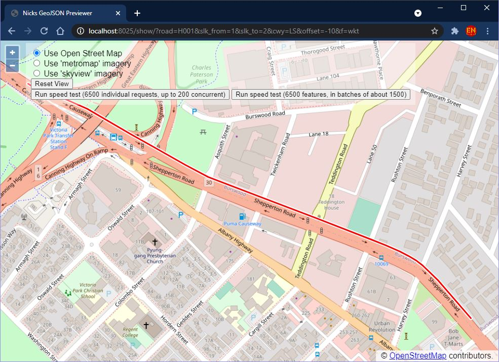

# NickLinRef <!-- omit in toc -->


NickLinRef is designed to accurately extract points or linestrings from the
[Western Australia Road Network](https://catalogue.data.wa.gov.au/dataset/mrwa-road-network)
geometry using `road/slk_from/slk_to` or just `road/slk`. Get results in either
`GeoJSON` or `WKT` formats.

Get results in Excel using the
[`=WEBSERVICE()` formula](https://support.microsoft.com/en-us/office/webservice-function-0546a35a-ecc6-4739-aed7-c0b7ce1562c4),
in PowerBI using the
[`Web.Contents()` function](https://learn.microsoft.com/en-us/powerquery-m/web-contents),
or best of all, in my custom PowerBI visual
[NickMapBI](https://github.com/thehappycheese/nickmap-bi) to dynamically
create and visualise geometry based on live data. Below is a screenshot of NickMapBI:


## Table of Contents: <!-- omit in toc -->

- [1. Getting Started](#1-getting-started)
- [2. Distinguishing Features](#2-distinguishing-features)
- [3. Usage](#3-usage)
  - [3.1. Get Lines - Query Parameters](#31-get-lines---query-parameters)
  - [3.2. Get Points - Query Parameters](#32-get-points---query-parameters)
  - [3.3. Extra Notes - Query Parameters](#33-extra-notes---query-parameters)
    - [3.3.1. `cwy=` Parameter](#331-cwy-parameter)
    - [3.3.2. `offset=` Parameter](#332-offset-parameter)
    - [3.3.3. `f=` Parameter](#333-f-parameter)
  - [3.4. Browser - `/show/` Page](#34-browser---show-page)
  - [3.5. Advanced - `/batch/` Route](#35-advanced---batch-route)
  - [3.6. `/batch2` unified batch requests](#36-batch2-unified-batch-requests)
  - [3.7. `/point` and `/line` routes](#37-point-and-line-routes)
  - [3.8. Additional Usage Notes](#38-additional-usage-notes)
    - [3.8.1. SLK, True Distance and Chainage](#381-slk-true-distance-and-chainage)
    - [3.8.2. Supported Network Types](#382-supported-network-types)
    - [3.8.3. Coordinate Reference System (CRS)](#383-coordinate-reference-system-crs)
- [4. Running the Server Yourself](#4-running-the-server-yourself)
  - [4.1. Installation](#41-installation)
  - [4.2. Compilation](#42-compilation)
    - [4.2.1. Compiling for Ubuntu / Debian](#421-compiling-for-ubuntu--debian)
    - [4.2.2. Compiling for Windows](#422-compiling-for-windows)
  - [4.3. Configuration](#43-configuration)
    - [4.3.1. Configuration - Command Line Interface (CLI)](#431-configuration---command-line-interface-cli)
    - [4.3.2. Configuration - Environment Variables](#432-configuration---environment-variables)
  - [4.4. Data Download and Refresh](#44-data-download-and-refresh)
- [5. Related Projects](#5-related-projects)
  - [5.1. Megalinref](#51-megalinref)
  - [5.2. NickMapBI](#52-nickmapbi)
  - [5.3. Python version (Predecessor to this Rust version)](#53-python-version-predecessor-to-this-rust-version)

## 1. Getting Started

First see [4. Running the Server Yourself](#4-running-the-server-yourself) or
[4.2. Compilation](#42-compilation) to get your copy of the server up and
running.

Next See the [3. Usage](#3-usage) section for some examples and detailed
documentation.

## 2. Distinguishing Features

NickLinRef is different from existing web services because it can accurately
truncate road centreline geometry at the requested `slk_from` and `slk_to`
endpoints. It can also correctly interpolate to find a Latitude Longitude point
at a requested `slk`. These features are not available in other existing APIs
such as those available from <https://data.wa.gov.au>.

- Superior performance under high traffic (for example if users are calling it
  from a large excel sheet using `=WEBSERVICE()`)
- Low server resource consumption (CPU, RAM, storage etc).
- Support for GeoJSON or WKT output formats.
- Support for `offset` operation which can assist in visualizing data for
  different lanes.
- Bandwidth-efficient `/batch/` mode to integrate with applications<br>
  (Such as custom PowerBI visuals)

## 3. Usage

When the web service is running locally (on your own machine) it can be accessed
at the following address by default:

`http://localhost:8080/...`

Query parameters must be added to the end of the url to get the desired results;
a query begins with `?` followed by a number of `{name}={value}` pairs separated
by `&`.

For example, the following request returns two points at `road=H001` and
`slk=2`. Note that the response contains two points because there are two
carriageways at this location. The response is in the default 'geojson' format:

<http://localhost:8080/?road=H001&slk=2&cwy=LS>

```json
{"type":"Feature","geometry":{"type":"MultiPoint", "coordinates":[
    [115.89702617983814,-31.97176876372234],
    [115.89692159880637,-31.97178473847775]
]}}
```

In the next example, a multi-linestring is returned rather than points. The
search has been limited to the `L`eft and `S`ingle carriageways, and an `offset` of
`-10` metres from the centreline has been applied, and the format is `wkt`:

<http://localhost:8080/?road=H001&slk_from=1&slk_to=1.1&cwy=LS&offset=-10&f=wkt>

```wkt
MULTILINESTRING ((115.88771097361135 -31.967604589743765,
115.88776331305647 -31.96753166223028,115.88782456479156 -31.967494045166685,
115.88808285746482 -31.967581573012584,115.88834117332095 -31.967675703676065),
(115.88735210575929 -31.967327078117492,115.88761740846113 -31.967472091243042),
(115.88761495220085 -31.96747075121283,115.88782449298621 -31.967576711138406))
```

In this final example, the `latlon` format is used to obtain a simple Latitude /
Longitude value. Note that `f=latlon` averages all matching point results to
ensure only a single coordinate is retuned:

<http://localhost:8080/?road=H001&slk=2&f=latlon>

```text
-31.971776751100045,115.89697388932225
```

The full set of allowed parameters are summarised in the following tables:

### 3.1. Get Lines - Query Parameters

| Name       | Description                                                                                                          | Allowed Values                                                                       | Example         | Case Sensitive | Required | Default   |
| ---------- | -------------------------------------------------------------------------------------------------------------------- | ------------------------------------------------------------------------------------ | --------------- | -------------- | -------- | --------- |
| `road`     | Road Number                                                                                                          | Valid Road / PSP Number (See [supported network types](#362-supported-network-types)) | `road=H001`     | ✔️              | ✔️        | -         |
| `slk_from` | [SLK](#361-slk-true-distance-and-chainage) to start the segment. If omitted, or -Infinity, return from start of road. | Any Number or `Infinity`                                                             | `slk_from=1.55` | ✔️              |          | -Infinity |
| `slk_to`   | [SLK](#361-slk-true-distance-and-chainage) to end the segment. If omitted, or +Infinity, return up to end of road.    | Any Number or `Infinity`<br>(>&nbsp;`slk_from`)                                      | `slk_to=2.3`    | ✔️              |          | +Infinity |
| `cwy`      | Filter for the carriageway.<br>See [`cwy` Parameter](#331-cwy-parameter)                                             | `L` `R` `S` `LS` `RS` `LR` `LRS`                                                     | `cwy=RS`        | ✔️              |          | `LRS`     |
| `offset`   | Metres to offset the resulting line from the road centre line.<br>See [`offset` Parameter](#332-offset-parameter)    | Positive or Negative Number<br><i>Note: Large values can cause blank output</i>      | `offset=-3.5`   | ✔️              |          | `0`       |
| `f`        | Desired response format (See [4.3.3. `f=` Parameter](#333-f-parameter))                                              | `geojson` `wkt` `json`                                                               | `f=geojson`     | ✔️              |          | `geojson` |
| `m`        | EXPERIMENTAL<br>Option to include `M` linear slk coordinates.                                                        | `true` `false`                                                                       | `m=true`        | ✔️              |          | `false`   |

### 3.2. Get Points - Query Parameters

| Name     | Description                                                                                                        | Allowed Values                                                                       | Example     | Case Sensitive | Required | Default   |
| -------- | ------------------------------------------------------------------------------------------------------------------ | ------------------------------------------------------------------------------------ | ----------- | -------------- | -------- | --------- |
| `road`   | Road Number                                                                                                        | Valid Road / PSP Number (See [supported network types](#362-supported-network-types)) | `road=H001` | ✔️              | ✔️        | -         |
| `slk`    | [SLK](#361-slk-true-distance-and-chainage) of the point                                                             | Positive Number                                                                      | `slk=3`     | ✔️              | ✔️        | -         |
| `cwy`    | Filter for the carriageway. <br>See [`cwy` Parameter](#331-cwy-parameter)                                          | `L` `R` `S` `LS` `RS` `LR` `LRS`                                                     | `cwy=RS`    | ✔️              |          | `LRS`     |
| `offset` | Metres to offset the resulting point from the road centre line.<br>See [`offset` Parameter](#332-offset-parameter) | Positive or Negative Number<br><i>Note: Large values can cause blank output</i>      | `offset=4`  | ✔️              |          | `0`       |
| `f`      | Desired response format. (See [4.3.3. `f=` Parameter](#333-f-parameter))                                           | `geojson` `wkt` `json` `latlon` `latlondir`                                          | `f=geojson` | ✔️              |          | `geojson` |

### 3.3. Extra Notes - Query Parameters

#### 3.3.1. `cwy=` Parameter

The following diagram illustrates the effect of the carriageway filter parameter
`cwy=` with some random examples.


Note that any combination of `L`, `R` and `S` can be
used. The filter is applied before any points or lines are sampled from the
centreline.

#### 3.3.2. `offset=` Parameter

The following diagram illustrates the effect of the offset parameter `offset=`.


The offset is applied before any points or lines are sampled from the road
centreline.

Note a rough approximation is used to generate offset points and linestrings.
Large offset values may cause blank response values. Try to keep it less then +-
40 metres.

#### 3.3.3. `f=` Parameter

| Format        | Specification                        | Notes                                                                                                                                                                                                                                                                                                 |
| ------------- | ------------------------------------ | ----------------------------------------------------------------------------------------------------------------------------------------------------------------------------------------------------------------------------------------------------------------------------------------------------- |
| `f=geojson`   | <https://geojson.org/>               | Responses are always wrapped in a `Feature` and will always   be either `"type":"MultiLineString"` or `"type":"MultiPoint"`                                                                                                                                                                           |
| `f=json`      | Derived from geojson                 | Nested array like the `"coordinates":...` attribute in the the geojson `MultiLineString` or `MultiPoint` specifications. It is intended to reduce unnecessary json overhead.                                                                                                                          |
| `f=wkt`       | <https://www.ogc.org/standard/sfa/>  |                                                                                                                                                                                                                                                                                                       |
| `f=latlon`    | `{latitude},{longitude}`             | Responses are always a single comma separated pair. If multiple points would have been returned (eg for left and right carriageway) then the average of these is returned.                                                                                                                            |
| `f=latlondir` | `{latitude},{longitude},{direction}` | Responses are always a single comma separated triplet. If multiple points would have been returned (eg for left and right carriageway) then the average of these is returned. The `direction` is in degrees measured anti-clockwise-positive from east. It is the is the direction of increasing SLK. |

> See also [Coordinate Reference System (CRS)](#363-coordinate-reference-system-crs)

### 3.4. Browser - `/show/` Page

Show mode works the same as described above, except that instead of returning
raw data, it displays an interactive map when viewed in a web browser. This is
useful to confirm that queries are working as intended. Simply add `/show/` to
the url before the query parameters:

[http://localhost:8080<b>/show/</b>?road=H001&slk_from=1&slk_to=2&cwy=LS&offset=-10&f=wkt](http://localhost:8080/show/?road=H001&slk_from=1&slk_to=2&cwy=LS&offset=-10&f=wkt)


Query mode can easily be used from Excel with the `=WEBSERVICE()` formula, or
from Power BI using the `=Web.Contents()` function.

### 3.5. Advanced - `/batch/` Route

`/batch/` mode is a bandwidth efficient alternative query method meant for
integration with apps and PowerBI custom visuals.

This mode expects a `POST` request to <http://localhost:8080/batch/> and does
not use url query parameters. See details below.

<details>

<summary>
Click to expand details of `/batch/` Mode
</summary>

Batch mode allows only linestring requests. The request is in a packed binary
format, the response will be gzipped a geojson `FeatureCollection` object.

The body of the request must be binary data consisting of a series of frames
with the format shown below. Any number of frames can be packed into a single
request.

Frame format:

| Byte Length | Type                  | Value                                  |
| ----------- | --------------------- | -------------------------------------- |
| 1           | Uint8                 | Number of bytes in `road` string `x`   |
| `x`         | Utf8 String           | `road` number                          |
| 4           | Float32 Little Endian | `slk_from` in kilometres               |
| 4           | Float32 Little Endian | `slk_to` in kilometres                 |
| 4           | Float32 Little Endian | `offset` in metres                     |
| 1           | Uint8                 | `cwy` (carriageways) (see table below) |

Value of `cwy`:

| `cwy` | Carriageway    | Binary          | Decimal |
| ----- | -------------- | --------------- | ------- |
| `R`   | Right only     | `0b0000_0001`   | 1       |
| `S`   | Single only    | `0b0000_0010`   | 2       |
| `RS`  | Right & Single | `0b0000_0011`   | 3       |
| `L`   | Left only      | `0b0000_0100`   | 4       |
| `LR`  | Left & Right   | `0b0000_0101`   | 5       |
| `LS`  | Left & Single  | `0b0000_0110`   | 6       |
| `LRS` | All            | any other value |         |

There is an example batch query implementation in `__static_http/main.js`
however a simplified version is shown below:

```javascript
// =========== Helper functions: ===========
let CWY_LOOKUP = {
    L: 0b0000_0100,
    R: 0b0000_0001,
    S: 0b0000_0010,
    LR: 0b0000_0101,
    LS: 0b0000_0110,
    RS: 0b0000_0011,
    LRS: 0b0000_0111
}
function binary_encode_request(road, slk_from, slk_to, offset, cwy) {
    let text_encoder = new TextEncoder();
    let road_bytes = text_encoder.encode(road);
    
    let buffer = new ArrayBuffer(1 + road_bytes.length + 4 + 4 + 4 + 1);

    let road_name_chunk = new Uint8Array(buffer, 0, 1 + road_bytes.length);
    road_name_chunk[0] = road_bytes.length;
    road_name_chunk.set(road_bytes, 1);

    let data_view = new DataView(buffer, 1 + road_bytes.length);
    data_view.setFloat32(0, slk_from, true) // LITTLE ENDIAN
    data_view.setFloat32(4, slk_to, true) // LITTLE ENDIAN
    data_view.setFloat32(8, offset, true) // LITTLE ENDIAN
    data_view.setUint8(12, CWY_LOOKUP[cwy.toUpperCase()] ?? 0); // use 0 if lookup fails

    return new Uint8Array(buffer);
}

// =========== Perform Batch Query ============

// Build batch query:
let request_body_parts = [
    binary_encode_request("H001", 1.0, 1.1, 0, "LRS"),
    binary_encode_request("H001", 3.0, 3.2, 0, "LS"),
    binary_encode_request("H002", 4.1, 4.2, 20, "LS")
];

// Find total query length in bytes:
let request_body_byte_length = request_body_parts.reduce(
    (total, item) => total + item.byteLength, 
    0 // initial value of total
);

// Pack all queries into a single byte array:
let request_body = new Uint8Array(request_body_byte_length);
request_body_parts.reduce((offset, byte_array) => {
        request_body.set(byte_array, offset);
        return offset + byte_array.byteLength;
    },
    0 // initial offset
)

// Send the request to the server
fetch("http://localhost:8080/batch/", {
        method: "POST",
        body: request_body
    }
)
.then(response => response.json())
.then(json => {
    let features = [];
    for (multi_line_string_coordinates of json) {
        if (multi_line_string_coordinates == null) continue;
        features.push({
            type: "Feature",
            geometry: {
                type: "MultiLineString",
                coordinates: multi_line_string_coordinates
            }
        });
    }
    let result = {
        type:"FeatureCollection",
        features
    }
    // DONE! 'result' is now a standard GeoJSON feature collection.
    //  ready to be used in a map or for other purposes.
    console.log(JSON.stringify(result));
});
```

The output of the script above is shown below:

```json
{
    "type":"FeatureCollection",
    "features":[
        {"type":"Feature","geometry":{"type":"MultiLineString","coordinates":[[[115.88778395521496,-31.967656968008896],[115.88783629466008,-31.96758404049541],[115.88784873900369,-31.967580563399395],[115.88804803150612,-31.96766437971354],[115.88831038467791,-31.967760094769094]],[[115.88778395521496,-31.967656968008896],[115.8877412235351,-31.967713333565143],[115.887742230063,-31.967723398843077],[115.8879828817074,-31.96785406445076]],[[115.8879828817074,-31.96785406445076],[115.88808710308484,-31.967912260057517]],[[115.8873090202252,-31.96740590345527],[115.88757432292704,-31.96755091658082]],[[115.8875744144296,-31.96755091658082],[115.88778395521496,-31.967656876506396]]]}},
        {"type":"Feature","geometry":{"type":"MultiLineString","coordinates":[[[115.90371854775746,-31.97874013724704],[115.90387696204294,-31.978944811166286],[115.90481214543112,-31.980341530482082]]]}},
        {"type":"Feature","geometry":{"type":"MultiLineString","coordinates":[[[115.79676132053224,-32.08478062909291],[115.79696805522983,-32.08570245636619]]]}}
    ]
}
```

</details>

### 3.6. `/batch2` unified batch requests

A new batch request route has been added to allow requesting both line and point features.

This route accepts either a `POST`or `GET` requests.

This version of the batch route does not use the complex binary protocol described above.

The format of the request is as follows;

```json
{
    "format":"wkt",
    "items":[
        {
            "road":"H001",
            "slk_from":10,
            "slk_to":20,
            "offset":10
        },
        {
            "road":"H016",
            "slk":10
        },
        {
            "road":"H015",
            "slk":10
        }   
    ]
}
```

When url encoded the above query should look like;

```text
format=wkt&items=%5B%7B%27road%27%3A+%27H001%27%2C+%27slk_from%27%3A+10%2C+%27slk_to%27%3A+20%2C+%27offset%27%3A+10%7D%2C+%7B%27road%27%3A+%27H016%27%2C+%27slk%27%3A+10%7D%2C+%7B%27road%27%3A+%27H015%27%2C+%27slk%27%3A+10%7D%5D
```

Formats supported are restricted to `wkt`, `geojson` or `json`

The result type is always a JSON list which is the same length as the `"items"` specified in the request.

Items that did not return a result may be either `null` or, due to a long outstanding issue, an invalid empty geometry like `MULTIPOINT ()` or a GeoJSON object with 0 coordinates.

 If `format=wkt` is specified, then each item will be either `null` or a `"wkt string"`. The result should look like;

```json
200
["MULTILINESTRING ((115.94759478043025 -32.02724359866268,...., 116.00968185354726 -32.0797516372457))","MULTIPOINT ((115.8018372737292 -31.890062043719624),(115.80208275968369 -31.88999214761082))","MULTIPOINT ((115.85393141776753 -32.048215776792965),(115.85365425352151 -32.04809166414051))"]
```

### 3.7. `/point` and `/line` routes

The `/point` and `/line` routes support BOTH `GET` and `POST` requests.

> Note: The first version of this server supported only `GET` requests against the
> root path `/` using url query parameters. To add support `POST` requests, I
> had to create two new routes `/line` and `/point`.
> 
> For backward compatibility `GET`, requests against root `/` will continue to
> work.

`POST` requests made against `/line` or `/route` must use the same parameters as
documented above, but formatted as JSON in the body of the request. For example
`GET localhost:8080/?road=H001&slk=10` becomes `POST localhost:8080/point` with
JSON body `{"road":"H001", "slk":10}`

### 3.8. Additional Usage Notes

#### 3.8.1. SLK, True Distance and Chainage

SLK stands for "Straight Line Kilometre" and is sometimes called 'chainage' or
'kilometrage' in other contexts.

At Main Roads Western Australia SLK refers to an "adjusted" linear measure which
has discontinuities called 'Points of Equation' (POE) (there are between 100 and
200 points of equation throughout the state road network) where there is an
abrupt increase or decrease in SLK. This is done so that when asset locations
are recorded by SLK, these records are not invalidated when a road realignment
project modifies the length of a road.

This software has no special compensation to handle POE discontinuities. Please
expect results at POEs to have gaps or overlaps.

The non-adjusted linear measure is called "True Distance".

This software is only capable of looking up Lat/Lon from SLK. True distance is
not yet supported.

#### 3.8.2. Supported Network Types

This tool is capable of querying all road network types included in this dataset
<https://portal-mainroads.opendata.arcgis.com/datasets/mainroads::road-network/about>

| Network Type               | Support |
| -------------------------- | ------- |
| State Roads                | ✔️       |
| Proposed State Roads       | ✔️       |
| Local Government Roads     | ✔️       |
| Main Roads Controlled Path | ✔️       |
| Miscellaneous Road         | ✔️       |
| Crossover                  | ✔️       |

#### 3.8.3. Coordinate Reference System (CRS)

The coordinate system of the returned geometry depends on the coordinate system
downloaded from `NLR_DATA_SOURCE_URL`.

However, `offset=` feature will only work correctly with EPSG:4326 (which is
also called WGS84. See <https://spatialreference.org/ref/epsg/wgs-84/>) This is
because the `&offset=...` uses an approximation to convert from meters to
degrees assuming that there are about `111320` metres per degree.

## 4. Running the Server Yourself

### 4.1. Installation

On windows you can use a pre-compiled version of this application; download the
latest version from [releases](/releases) and extract the zip file.

Run `nicklinref.exe` then visit
<http://localhost:8080/?road=H001&slk_from=1.5&slk_to=3> to test if it is
working.

On Linux the best way to use this software is to clone this repository and
build it yourself. See instructions below.

### 4.2. Compilation

#### 4.2.1. Compiling for Ubuntu / Debian

Install required packages:

```bash
sudo apt update
sudo apt-get install build-essential pkg-config git
```

> Note: On some linux distros, the packages `libssl-dev` and `build-essential`
> may have different names. `build-essential` contains the `libc` package which
> is needed by some rust packages to interact with other platform code.

> Note: In previous version `libssl-dev` and `pkg-config` may be needed. Newer
> version use rust-tls and do not depend on openssl.

Install Rust:

Follow the this guide <https://www.rust-lang.org/tools/install>
Probably something like this:

```bash
curl --proto '=https' --tlsv1.2 -sSf https://sh.rustup.rs | sh
source "$HOME/.cargo/env"
```

Clone this repository

```bash
git clone https://github.com/thehappycheese/nicklinref_rust
cd nicklinref_rust
```

Build and run:

```bash
cargo run --release
```

#### 4.2.2. Compiling for Windows

Install rust: <https://www.rust-lang.org/tools/install>. You may be prompted to
install some microsoft visual C++ thing which is used for linking native
executables.

Clone this repository

```powershell
git clone https://github.com/thehappycheese/nicklinref_rust
cd nicklinref_rust
```

Build and run:

```powershell
cargo run --release
```

### 4.3. Configuration

LinRef can be configured using either environment variable or command line
arguments. (Previous versions supported a `config.json` option, but support for
this is dropped because it was never used)

#### 4.3.1. Configuration - Command Line Interface (CLI)

nicklinref supports a help command flag which will print out the most current
command line documentation.

```powershell
nicklinref.exe --help
```

```text
Usage: nicklinref [OPTIONS]

Options:
      --ip-address <NLR_ADDR>
          The IP address to listen on [env: NLR_ADDR=] [default: 127.0.0.1]
      --port <NLR_PORT>
          The port to listen on [env: NLR_PORT=] [default: 8080]
      --data-file <NLR_DATA_FILE>
          File path to where the cache data file is/will be stored, including file name [env: NLR_DATA_FILE=] [default: ./data/data.json.lz4]
      --static-http <NLR_STATIC_HTTP>
          Folder path containing static http files for the /show/ route [env: NLR_STATIC_HTTP=] [default: ./__static_http]
      --force-update-data
          Cause the old data cache file to be deleted and re-downloaded [env: NLR_FORCE_UPDATE_DATA=]
      --data-source-url <NLR_DATA_SOURCE_URL>
          Url of the esri rest service hosting the road network data [env: NLR_DATA_SOURCE_URL=] [default: https://mrgis.ma...]
  -h, --help
          Print help
```

#### 4.3.2. Configuration - Environment Variables

As an alternative to command line options, environment variables can be used  instead.

> Environment variables are overridden by any command line options.

| Property              | Description                                                                                                                                                                                                                                                                                                                                                                                                                                                                                                                                                                        |
| --------------------- | ---------------------------------------------------------------------------------------------------------------------------------------------------------------------------------------------------------------------------------------------------------------------------------------------------------------------------------------------------------------------------------------------------------------------------------------------------------------------------------------------------------------------------------------------------------------------------------- |
| `NLR_ADDR`            | A string containing an IPV4 or IPV6 address. Using 127.0.0.1 will limit traffic to your own machine for testing purposes. 0.0.0.0 will allow requests from anywhere on the local network.                                                                                                                                                                                                                                                                                                                                                                                          |
| `NLR_PORT`            | A port number.                                                                                                                                                                                                                                                                                                                                                                                                                                                                                                                                                                     |
| `NLR_DATA_FILE`       | The filename of the data cached from `NLR_DATA_SOURCE_URL`. **The directory must already exist**. If the file does not already exist then it will be created and fresh data will be downloaded.                                                                                                                                                                                                                                                                                                                                                                                    |
| `NLR_DATA_SOURCE_URL` | This is the ArcGIS REST service where the road network is downloaded from. It is assumed that multiple requests are needed and the `&resultOffset=...` parameter is used to repeatedly fetch more data. Only certain fields are fetched `outFields=ROAD,START_SLK,END_SLK,CWY` and the output spatial reference is specified `&outSR=4326`. ESRI's own json format (`&f=json`) is expected because `&f=geojson` does not seem to work properly. Also note that currently the field names `ROAD`, `START_SLK`, `END_SLK`, `CWY` are hard-coded and must exist on the incoming data. |
| `NLR_STATIC_HTTP`     | Used by the `/show/` feature to display an interactive map. The directory specified by this config option should exist or I think the application may crash on startup. The directory can probably be empty though if it is not required. The `__static_http` folder in this repo contains the files required.                                                                                                                                                                                                                                                                     |

### 4.4. Data Download and Refresh

To refresh your data, simply manually delete the file specified by the
`NLR_DATA_FILE` option and restart the application. Alternatively add the
`--force-update-data` flag to the command line when launching the server. Fresh
data will be downloaded.

## 5. Related Projects

### 5.1. Megalinref

[Megalinref](https://github.com/thehappycheese/megalinref) is an attempt to
bring the functionality of this server directly to python. It is a rust-powered
python library that will do all the same things as this server, but without the
overhead of running a rest service on localhost.

### 5.2. NickMapBI

[NickMapBI](https://github.com/thehappycheese/nickmap-bi/) is a custom PowerBI
visual which calls into a running instance of NickLinRef.

### 5.3. Python version (Predecessor to this Rust version)

This repo is a rust implementation of my previous project written in python:
<https://github.com/thehappycheese/linear_referencing_geocoding_server>
