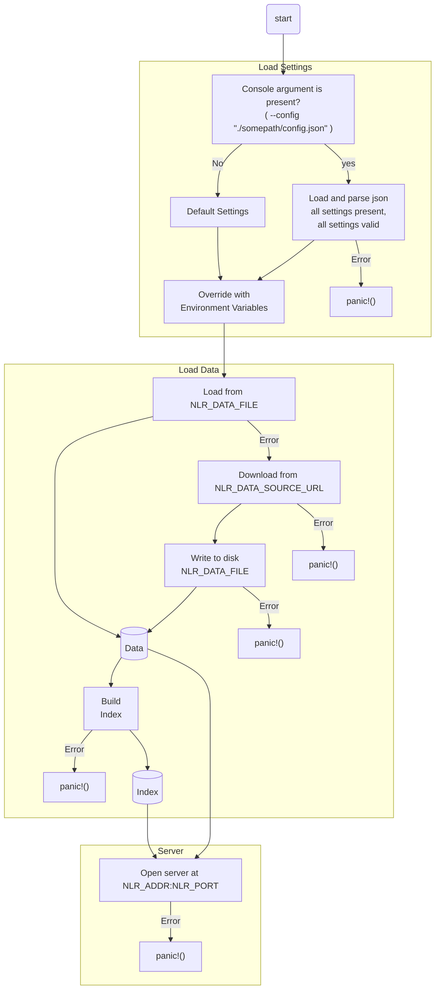

```mermaid

flowchart TD
    A(start) --> B1a
    subgraph Load Settings
        B1a["Console argument is present?<br>( --config #quot;./somepath/config.json#quot; )"]

		B1a1[Load and parse json<br>all settings present,<br>all settings valid] --> B2
		B1a1-->|Error| P1

        B1b[Default Settings]
        B2[Override with<br>Environment Variables]
        B1a-->|No| B1b
        B1a-->|yes| B1a1
        B1b-->B2
		P1["panic!()"]
    end
    B2-->C
    subgraph Load Data
        C[Load from NLR_DATA_FILE] --> D
		C-->|Error| E

		E[Download from NLR_DATA_SOURCE_URL] --> F
		E-->|Error| P2["panic!()"]

		F[Write to  disk<br>NLR_DATA_FILE] --> D
		F-->|Error| P3["panic!()"]

		D[(Data)] -->H
		

		H-->|Error| P4["panic!()"]
		
		H[Build<br>Index] --> II[(Index)]

    end
	subgraph Server
		D-->Q
		II-->Q
		Q[Open server at NLR_ADDR:NLR_PORT]
		Q-->|Error| P5
		P5["panic!()"]
	end
	
```